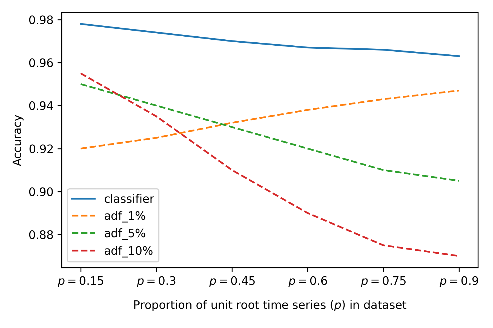

##LSTM 분류기를 이용한 단위근 개수 예측과 비이론적 시계열에의 적용 평가
- (Predicting the Number of Unit Roots Using LSTM Classifiers and Evaluating Applicability to Non-Theoretical Time Series)

- 본 연구에서는 대표적인 단위근 검정인 ADF 검정을 딥러닝 방법론인 LSTM 구조를 통해 구현함으로써 거기서 통계적 인사이트를 얻고자함.

### 1️⃣ simulation data 생성 구조.
- **정상 시계열**: `Z_t = φ₁Z_{t−1} + φ₂Z_{t−2} + ε_t`, `ε_t ~ WN(0,1), φ₁, φ₂~ i.i.d U(-0.9, 0.9)' under stationarity condition.
- **단위근 시계열**: 정상 시계열을 누적합한 이론적인 단위근 시계열 
  - 1차 누적합 → 단위근 1개  : Z^{(1)}_{t} = \sum_{i=1}^{t} Z_{i}
  - 2차 누적합 → 단위근 2개  : Z^{(2)}_{t} = \sum_{i=1}^{t} Z^{(1)}_{i}
- 시계열의 길이는 100으로 동일하며, training set,validation set, test set은 각각 100,000/30,000/10,000 샘플.
### 2️⃣ LSTM Classifier 구조 및 hyperparameter 설정
- 입력 벡터: 길이 100의 시계열 입력 벡터.
- 모델 구조: LSTM(hidden state=30) → Dense Layer(Softmax)
- 분류 방식:
  - **Binary**: ADF검정에서 가설 검정을 하는 것과 동일함.  H0(비정상) vs H1(정상)
  - **3-Class**: 시계열 입력 벡터에 내재된 단위근 개수 (0, 1, 2) 예측.
- 손실 함수: Categorical Cross-Entropy
- 최적화 알고리즘: Adam
- Batch size: 1000
- 최대 Epoch: 200
- Early Stopping: validation loss 10회 미개선 시 학습 종료.

### 3️⃣ 성능 비교 대상 및 지표
- 비교 대상: 유의수준 1%,5%,10% 별 ADF (Augmented Dickey-Fuller) 검정
- 평가 지표:
  - **정확도 (Accuracy)**
  - **경험적 사이즈 (Empirical Size)**: 단위근 시계열을 정상 시계열로 오분류한 비율
  - **경험적 검정력 (Empirical Power)**: 정상 시계열을 정상 시계열로 올바르게 분류한 비율
  - ![그래프] (./figures/model_eval.png)
  - 전체적으로 LSTM classifier의 성능이 ADF 검정에 비해 우수함.

### 4️⃣ 모델의 일반화 성능 평가를 위한 combine dataset 구성(비이론적 테스트 데이터셋 생성)
-  정상+단위근을 앞/뒤 절반으로 결합하여 생성한 단위근 시계열.  
-  앞 50% 정상 + 뒤 50% 단위근 (또는 그 반대)
- 여기에 더해 단위근 시계열 비율 `p`를 변화시키는 조건을 더함으로써 combine test dataset 구성  
- `p ∈ {0.15, 0.3, 0.45, 0.6, 0.75, 0.9}`
- 각 `p`에 대해 10,000개 샘플 생성
- 6개의 combine test dataset에 대한 LSTM classifier와 ADF 검정의 성능 비교.
- 
- classifier의 accuracy는 6개의 testset에서 대체로 일정하고, 준수함. 반면에 ADF 검정은 유의수준에 따라, 데이터셋의 단위근 시계열 구성 비율에 따라 큰 변동을 보임.
- 유의수준 1% ADF 검정의 accuracy가 단위근 시계열의 비율이 높아질 수록 accuracy가 상승하는 것을 확인할 수 있음. 이는 유의수준 1%에서 검정이 극도로 보수적인 경향을 보여, 단위근 시계열의 비중이 높을 수록 accuracy가 높게 나타나는 것으로 보임.

### 5️⃣ 3-class classifier로의 확장을 통한 단위근 개수 예측.

- 3-Class 분류 혼동 행렬: `figures/confusion_matrix.png`

> 📁 모든 결과 그래프는 `figures/` 폴더에 포함되어 있습니다.

