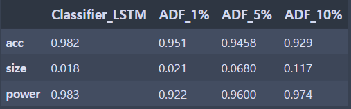
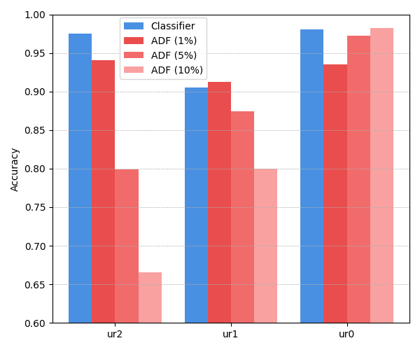
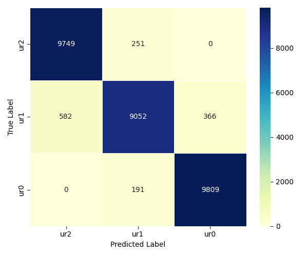

## 📝 Abstract

This study proposes an LSTM-based deep learning classifier as an alternative approach to the traditional Augmented Dickey-Fuller (ADF) test for identifying unit roots in time series data. The model is designed not only to detect the presence of unit roots but also to estimate their count, enabling a more nuanced interpretation of nonstationarity.

Simulated AR(2) time series were generated under controlled settings, including both theoretical and hybrid (non-theoretical) configurations. Experimental results show that the proposed classifier outperforms ADF in accuracy and robustness across various test scenarios, including mixed-series inputs. 

Notably, the classifier demonstrates stable performance even when applied to non-theoretical or partially stationary series, where ADF tends to vary significantly. The model's extension to a 3-class classification task further confirms its ability to distinguish between series with zero, one, or two unit roots.

The results suggest that deep learning-based classifiers offer a flexible and powerful alternative for structural inference in time series analysis, especially in environments where classical assumptions do not hold.

# 📘 LSTM 분류기를 이용한 단위근 개수 예측과 비이론적 시계열에의 적용 평가
Predicting the Number of Unit Roots Using LSTM Classifiers and Evaluating Applicability to Non-Theoretical Time Series

본 프로젝트는 지도교수님의 컨펌을 받은 석사 논문 기반이며, 현재 학회 투고를 준비 중인 연구를 코드로 정리한 자료입니다.

본 논문은 전통적인 단위근 검정(unit root test)인 ADF(Augmented Dickey-Fuller) 검정을 LSTM 기반 딥러닝 분류기로 구현하여, 시계열 정상성 판별에 새로운 접근을 제안합니다.
또한 단위근 개수 예측과 비이론적 시계열에의 적용을 통해 분류기의 일반화 성능을 평가합니다.

### 1️⃣ simulation data 생성 구조.
- **정상 시계열**: `Z_t = φ₁Z_{t−1} + φ₂Z_{t−2} + ε_t`, `ε_t ~ WN(0,1), φ₁, φ₂~ i.i.d U(-0.9, 0.9)' under stationarity condition.
- **단위근 시계열**: 정상 시계열을 누적합한 이론적인 단위근 시계열 
  - 1차 누적합 → 단위근 1개
  - 2차 누적합 → 단위근 2개
- 시계열의 길이는 100으로 동일하며, training set,validation set, test set은 각각 100,000/30,000/10,000 샘플.
### 2️⃣ LSTM Classifier 구조 및 hyperparameter 설정
- 입력 벡터: 길이 100의 시계열 입력 벡터.
- 모델 구조: [Input: Z₁ ~ Z₁₀₀] → [LSTM (30)] → [Dense (2)] → [Softmax]
- 분류 방식:
  - **Binary**: ADF검정에서 가설 검정을 하는 것과 동일함.  H0(비정상) vs H1(정상)
  - **3-Class**: 시계열 입력 벡터에 내재된 단위근 개수 (0, 1, 2) 예측.
- 손실 함수: Categorical Cross-Entropy
- 최적화 알고리즘: Adam
- Batch size: 1000
- 최대 Epoch: 200
- Early Stopping: validation loss 10회 미개선 시 학습 종료.

### 3️⃣ 성능 비교 대상 및 지표
- 비교 대상: 유의수준 1%,5%,10% 별 ADF (Augmented Dickey-Fuller) 검정
- 평가 지표:
  - **정확도 (Accuracy)**
  - **경험적 사이즈 (Empirical Size)**: 단위근 시계열을 정상 시계열로 오분류한 비율
  - **경험적 검정력 (Empirical Power)**: 정상 시계열을 정상 시계열로 올바르게 분류한 비율
  
- 전체적으로 LSTM classifier의 성능이 ADF 검정에 비해 우수함.

### 4️⃣ 모델의 일반화 성능 평가를 위한 combine dataset 구성(비이론적 테스트 데이터셋 생성)
-  정상+단위근을 앞/뒤 절반으로 결합하여 생성한 단위근 시계열.  
-  앞 50% 정상 + 뒤 50% 단위근 (또는 그 반대)
- 여기에 더해 단위근 시계열 비율 `p`를 변화시키는 조건을 더함으로써 combine test dataset 구성  
- `p ∈ {0.15, 0.3, 0.45, 0.6, 0.75, 0.9}`
- 각 `p`에 대해 10,000개 샘플 생성
- 6개의 combine test dataset에 대한 LSTM classifier와 ADF 검정의 성능 비교.

- classifier의 accuracy는 6개의 testset에서 대체로 일정하고, 준수함. 반면에 ADF 검정은 유의수준에 따라, 데이터셋의 단위근 시계열 구성 비율에 따라 큰 변동을 보임.
- 유의수준 1% ADF 검정의 accuracy가 단위근 시계열의 비율이 높아질 수록 accuracy가 상승하는 것을 확인할 수 있음. 이는 유의수준 1%에서 검정이 극도로 보수적인 경향을 보여, 단위근 시계열의 비중이 높을 수록 accuracy가 높게 나타나는 것으로 보임.

### 5️⃣ 3-class classifier로의 확장을 통한 단위근 개수 예측.
- 모델 구조: [Input: Z₁ ~ Z₁₀₀] → [LSTM (30)] → [Dense (3)] → [Softmax]
- hyperparameter 설정은 동일
- 1️⃣의 데이터 생성 구조에 따라 ur2(단위근 2개),ur1(단위근 1개),ur0(정상 시계열)을 각 10,000샘플씩 생성하고 이에 대한 3-class classifier의 accuracy를 확인함.

- ur2 class에서 classifier와 ADF 검정의 차이가 뚜렷하게 나타남. ADF 검정은 해당클래스에서유의수준에따라성능이급격히저하되어
최저 66.6%까지 감소한 반면, 제안한 분류기는 97.5%의 높은 정확도를 안정적으로 유지함.

- 3-Class classifier의 confusion matrix heatmap.
- ur0 클래스는 98% 이상 정확하게 분류됨
-  단위근 시계열인 (ur1, ur2) class 총 20,000개의 단위근 시계열 중 분류기가 이를 ur2로 판단한 경우는 10,331건, ur1으로 판단한 경우는 9,303건, ur0로 잘못 분류한 경우는 단 366건에 불과함.
- 이는 분류기가 단위근이 존재하는 시계열을 정상 시계열로 오분류하는 경우가 드물며, 시계열의 비정상성을 본래보다 다소 강하게 판단하는 경향을 보였음을 시사함.

## ✅ 결론 및 향후 연구 방향

본 연구는 전통적인 단위근 검정인 ADF에 대한 대안으로, LSTM 기반 딥러닝 분류기를 적용하여 단위근의 존재 여부뿐 아니라 개수까지 예측 가능한 구조를 제안하였습니다. 실험 결과, 제안한 분류기는 이론적 AR(2) 시계열뿐 아니라 혼합 구조의 비이론적 시계열에서도 일관된 성능을 보였으며, ADF 검정보다 높은 정확도를 나타냈습니다.

특히, 3-Class 분류 구조로 확장한 실험에서 단위근이 2개인 경우 ADF와 큰 성능 차이를 보임을 확인하였으며, 분류기는 정상 시계열로의 오분류를 최소화하며 시계열의 비정상성을 다소 강하게 인식하는 경향을 확인할 수 있었습니다.

이러한 접근은 전통적 통계 검정과 달리, 검정 통계량의 정의나 분포 가정 없이 학습 기반으로 정상성 판별 문제를 해결할 수 있다는 점에서 의미가 있습니다. 다만, 학습 구조에 대한 사전 설계가 요구되며, 이는 동시에 다양한 후속 연구 방향으로의 확장을 가능하게 합니다.

### 🔭 향후 연구 방향
- **AR 계수 추출 구간 조정**: 단위근 경계 인근에서의 분류 민감도 평가
- **다양한 단위근 개수의 시계열로 모델 학습**: 차분 차수 추정 가능성 탐색
- **ARIMA등 다양한 시계열 모형으로 data generator 확장**
- **실제 경제 데이터셋 적용**: 모델의 실용성 및 robustness 검토

> 📁 모든 결과 그래프는 `figures/` 폴더에 포함되어 있습니다.

